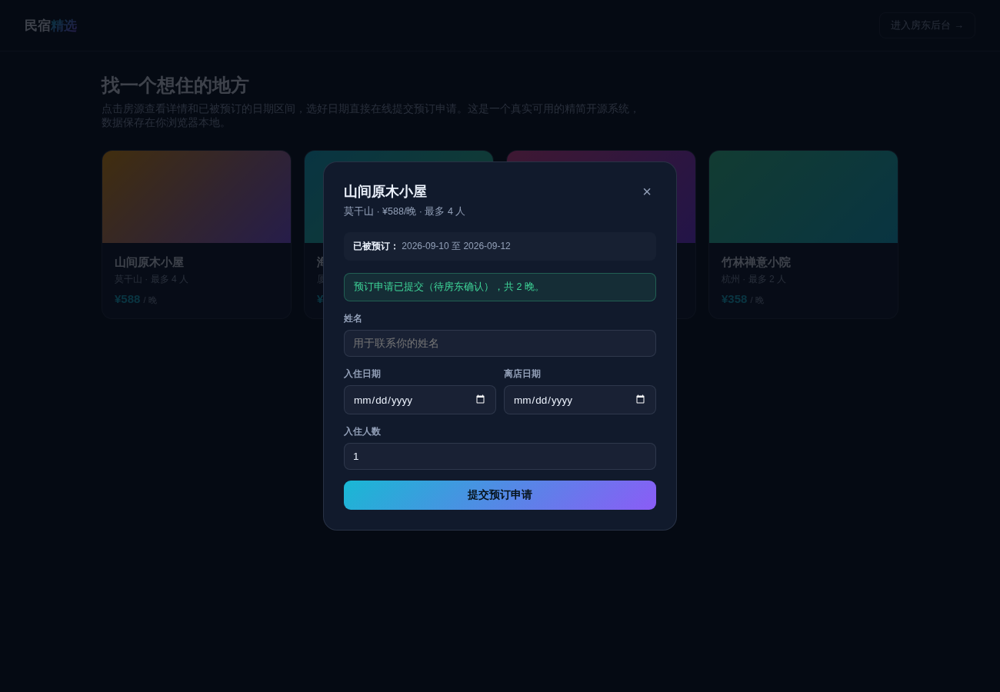

# 民宿短租管理系统（精简开源版）· Minsu Lite

**[在线体验（前台）→](https://anna123123123-creator.github.io/minsu-lite/)** · **[房东后台 →](https://anna123123123-creator.github.io/minsu-lite/admin.html)**

免费开源的民宿短租管理系统精简版。这不是截图或原型图，是一个**真实可用**的前后台系统：房源浏览、在线预订、可用日期查询、防止双重预订，后台房源增删改查、订单确认/取消、数据看板——都是真功能，纯前端 + `localStorage` 实现，不需要服务器、不需要数据库，克隆下来打开就能用，也适合作为学习或二次开发的起点。



## 功能

**前台（客人视角）**
- 房源列表浏览
- 点开房源查看已被预订（已确认）的日期区间
- 在线提交预订申请，自动校验：离店日期须晚于入住日期、入住人数不超过房源容纳上限、日期不能和已确认订单冲突

**后台（房东视角）**
- 仪表盘：房源总数、待确认/已确认订单数、本月确认收入（按房源单价 × 入住晚数实时计算）
- 房源管理：新增、编辑、删除房源
- 订单管理：按状态筛选，确认或取消预订申请

## 试用方法

克隆下来，直接用浏览器打开 `index.html`，或用静态文件服务器跑起来：

```bash
python3 -m http.server 8000
```

前台在 `index.html`，后台在 `admin.html`。所有数据存在浏览器的 `localStorage` 里（`minsu_lite_data_v1` 这个 key），后台侧边栏有"重置示例数据"按钮可以随时清空重来。

## 技术说明

没有用任何框架或构建工具，纯原生 HTML/CSS/JavaScript，一共 4 个文件：`data.js`（数据层，负责 localStorage 读写和种子数据）、`index.html` + `script.js`（前台）、`admin.html` + `admin.js`（后台）。因为是纯前端 Demo，数据只存在当前浏览器里，不同设备/浏览器之间不会同步——真实生产系统需要一个后端 API 和数据库来替换 `data.js` 里的存储层，其余的界面和交互逻辑基本可以直接复用。

## 协议

MIT，随便怎么用都行。

## 相关项目

这是完整版**民宿短租一体化管理系统**的精简开源示例——完整版支持多平台房态同步、智能门锁联动、多房东多角色权限、真实的订单支付与结算，源码在这：[民宿短租管理源码](https://inzyxuashop.com/minsu-yuanma.html)。
